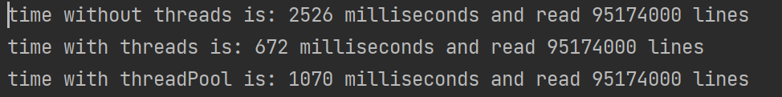

# **Part A:**

In this part of the assigment we were asked to build a program
that reads the amount of lines in a file in 3 ways
1) Without any threads
2) Using basic threads
3) Using Thread pool

**class diagram** : [partA.uml](partA.uml)

We created 1000 files and passed seed as 5 and the bound to 99999.

## **The result are:**

Let's examine the results:
1) Without any threads the program took the longest to run (2526 Milliseconds)
the reason is that all the work is being done on the main thread without splitting the work
so the program work on 1 file at a time.
2) Using basic thread the result is the fastest to run (672 Milliseconds)
reason being that we are now able to split the work and each thread works on 1 file,
and they run asynchronously.
3) Using thread pool program took (1070 Milliseconds) 
here we are also able to split the work between threads 
but upon some research we discovered that sometimes the thread-pool is faster and sometimes using basic threads is faster
   (it depends on the pc cpu and other components)

# **Part B:**
We were asked to build a thread-pool that consider the task priority.

class diagram: [PartB.uml](PartB.uml)

We created a Task class that is the Task we want to execute asynchronously
and each task have a priority to be executed.

the basic task types are:
COMPUTATIONAL (Default if no priority is given ),IO and OTHER.

We used a design pattern called Factory method in order to create a Task instance.

The CustomExecutor is the Thread-pool, and it does all the "heavy-lifting"

The Thread-pool holds a PriorityQueue that can determine which task needs to be executed first.

We want to have a min&max amount of threads depending on the user PC.

The Thread-pool have a separate thread running in the background that removes Tasks that are in the PriorityQueue and moves them to a list
of tasks that are being executed.
when a task is done we are able to safely remove the task from the list and replace it with a new task (if the PriorityQueue is not empty)

Once we are done, and we call gracefullyTerminate() we do not allow any new Tasks to be submited
and wait for all the current tasks to finish.

